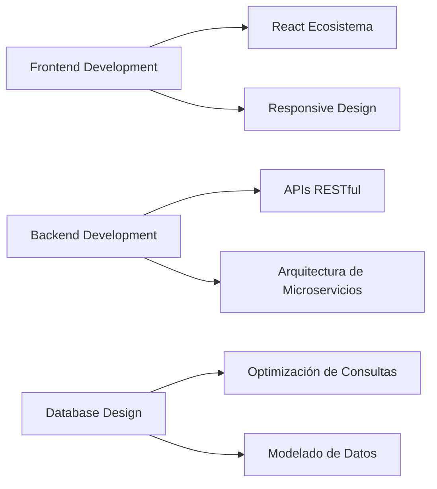

# 👋 ¡Hola! Soy [Tu Nombre]

> Desarrollador Full Stack apasionado por crear soluciones elegantes y funcionales

---

## 🚀 Sobre mí

Desarrollador con experiencia en tecnologías web modernas y desarrollo de aplicaciones robustas. Me especializo en crear experiencias de usuario excepcionales y arquitecturas backend escalables.

```javascript
const developer = {
    name: "Tu Nombre",
    role: "Full Stack Developer",
    location: "Tu Ciudad",
    passion: ["Clean Code", "UI/UX", "Performance", "Innovation"],
    currentFocus: "Construyendo el futuro, una línea de código a la vez"
};
```

---

## 🛠️ Stack Tecnológico

### Frontend


### Backend


### Bases de Datos


### Lenguajes de Programación


### Herramientas & DevOps


---

## 📊 Estadísticas de GitHub

<div align="center">
  
  
</div>

---

## 🎯 Experiencia


```mermaid
graph LR
    A[Frontend Development] --> B[React Ecosistema]
    A --> C[Responsive Design]
    D[Backend Development] --> E[APIs RESTful]
    D --> F[Arquitectura de Microservicios]
    G[Database Design] --> H[Optimización de Consultas]
    G --> I[Modelado de Datos]
```

---

## 🌟 Proyectos Destacados

### 🚀 [Nombre del Proyecto 1]
> Descripción breve del proyecto más importante
- **Tech Stack:** React, Node.js, PostgreSQL
- **Características:** Autenticación, Dashboard, API REST

### 💡 [Nombre del Proyecto 2]
> Descripción de otro proyecto relevante
- **Tech Stack:** Astro, Python, MySQL
- **Características:** SSG, Performance optimizado

### 🔧 [Nombre del Proyecto 3]
> Herramienta o utilidad que desarrollaste
- **Tech Stack:** C#, .NET, SQL Server
- **Características:** Desktop app, Base de datos integrada

---

## 📈 Actividad de Desarrollo

<div align="center">
  
</div>

---

## 🤝 Conecta Conmigo

<div align="center">

[](https://linkedin.com/in/tu-perfil)
[](https://tu-portfolio.com)
[](mailto:tu-email@ejemplo.com)
[](https://twitter.com/tu-usuario)

</div>

---

<div align="center">
  
</div>

<div align="center">
  
**"Code is poetry written for machines, but appreciated by humans"** ✨

</div>
